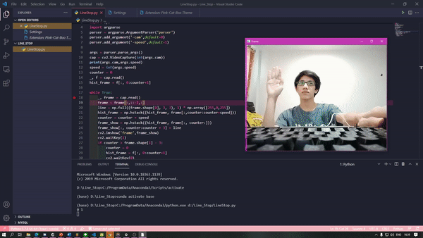

# Time-Warp-Scan-Python
Time Warp Scan filter implemented using OpenCV and Python

REQUIREMENT : opencv-python  
USAGE : python Time_Warp_Scan.py -cam [CAM_NO] 
        : *When the line is finished scanning. press any key to restart 

